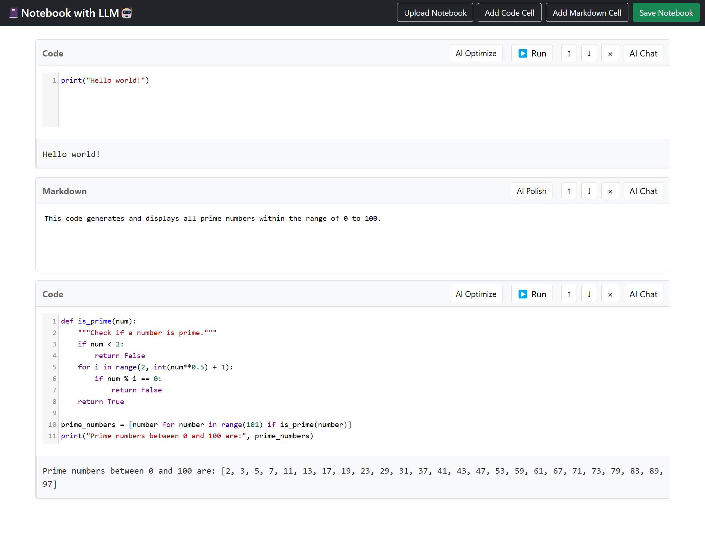

# 📓Notebook with LLM🤖

A web-based Jupyter notebook editor with AI capabilities powered by OpenAI's GPT models.



## Features

- Interactive Jupyter-like notebook interface
- 🦾 AI-powered code optimization and markdown polishing
- 🔧 Code formatting using Black
- 🤖 AI chat assistant for coding and writting help

- Create and edit Jupyter notebooks in your browser
- Support for both code and markdown cells
- Code execution with Python kernel
- Load and save notebooks
- Responsive interface

## Setup

1. Clone the repository:
```bash
git clone https://github.com/fyc2646/nb-llm.git
cd nb-llm
```

2. Install dependencies:
```bash
pip install -r requirements.txt
```
If you would like to use other libraries such as numpy and matplotlib, you can add them to the requirements.txt file and install them together.


3. Create a `.env` file in the root directory and add your OpenAI API key:
```
OPENAI_API_KEY=your_api_key_here
```

4. Run the application:
```bash
python app.py
```

5. Open your browser and navigate to `http://localhost:5000`

## Usage

### Code Cells
- Write Python code in code cells
- Click "▶ Run" to execute the code
- Click "🔧 Format" to automatically format your code using Black
- Click "🦾 AI Optimize" to get AI suggestions for code improvement
- Click "🤖 Chat" to discuss your code with the AI assistant

### Markdown Cells
- Write markdown in markdown cells
- Click "🦾 AI Polish" to improve your markdown content
- Real-time preview of markdown rendering

## Technologies Used

- Backend: Flask (Python)
- Frontend: JavaScript, CodeMirror
- Styling: Bootstrap, Custom CSS
- AI: OpenAI GPT-4o

## License

MIT License
