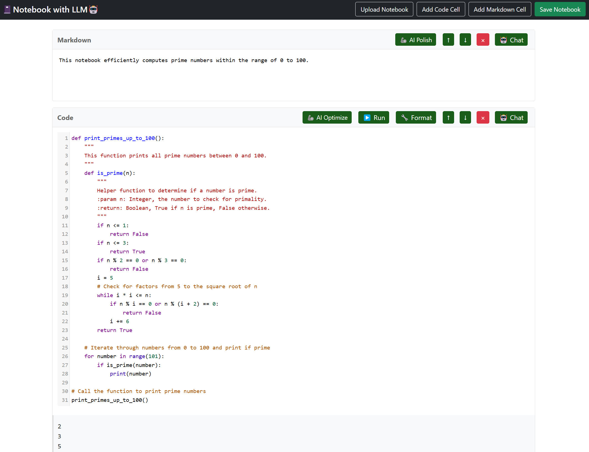

# 📓Notebook with LLM🤖

A web-based Jupyter notebook editor with AI capabilities powered by OpenAI's GPT models.



## Features

- Create and edit Jupyter notebooks in your browser
- Support for both code and markdown cells
- Live code execution with Python kernel
- AI-powered features:
  - AI Chat: Get help with your code or markdown
  - AI Polish: Improve your markdown content
  - AI Optimize: Enhance your Python code
- Upload and save notebooks
- Move and delete cells
- Beautiful, responsive interface

## Setup

1. Clone the repository:
```bash
git clone https://github.com/fyc2646/nb-llm.git
cd nb-llm
```

2. Install dependencies:
```bash
pip install -r requirements.txt
```
If you would like to use other libraries such as numpy and matplotlib, you can add them to the requirements.txt file and install them together.


3. Create a `.env` file in the root directory and add your OpenAI API key:
```
OPENAI_API_KEY=your_api_key_here
```

4. Run the application:
```bash
python app.py
```

5. Open your browser and navigate to `http://localhost:5000`

## Usage

1. **Adding Cells**: Use the "Add Code Cell" or "Add Markdown Cell" buttons to create new cells
2. **Editing Cells**: Click on a cell to edit its content
3. **Moving Cells**: Use the up/down arrows to reorder cells
4. **Deleting Cells**: Click the "×" button to remove a cell
5. **Code Execution**: Click the "▶ Run" button to execute Python code. Variables persist between cells
6. **AI Features**:
   - Click "AI Chat" to get help with your code or markdown. The AI response can be directly applied to the cell
   - Use "AI Polish" to automatically polish the markdown content in the cell
   - Use "AI Optimize" to automatically optimize the Python code in the cell

## Technologies Used

- Backend: Flask (Python)
- Frontend: JavaScript, CodeMirror
- Styling: Bootstrap, Custom CSS
- AI: OpenAI GPT-4o

## License

MIT License
